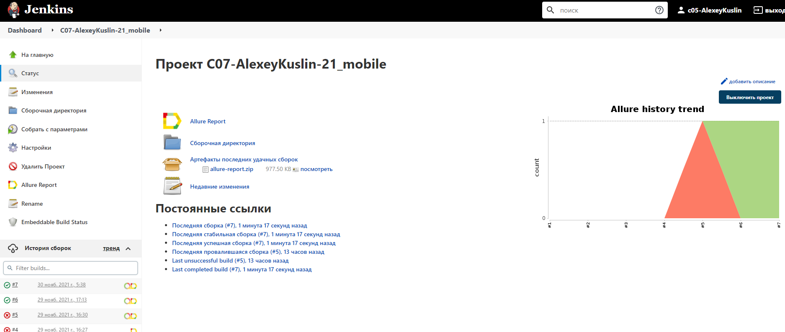
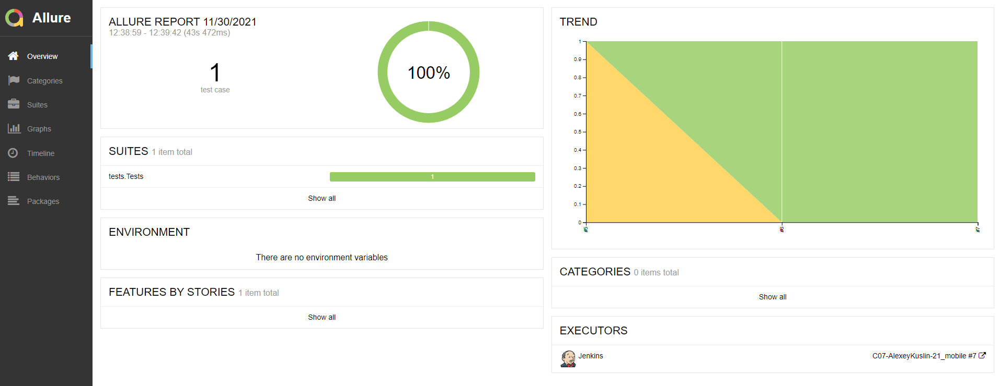
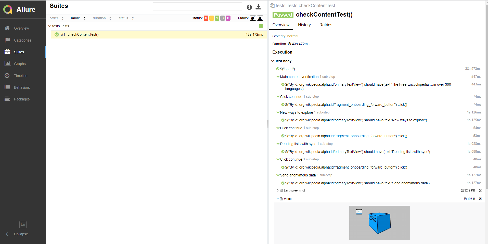
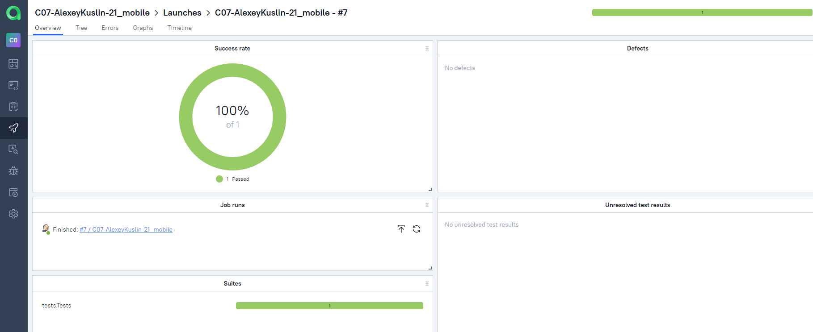
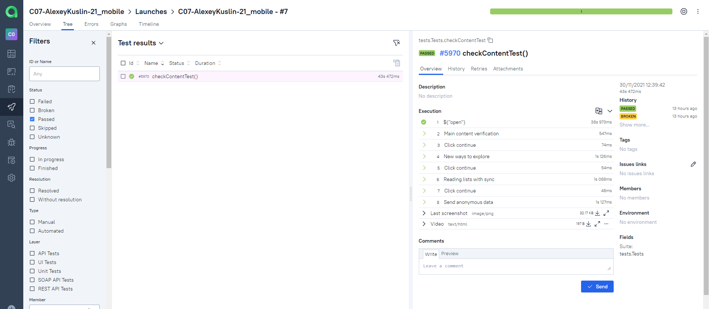
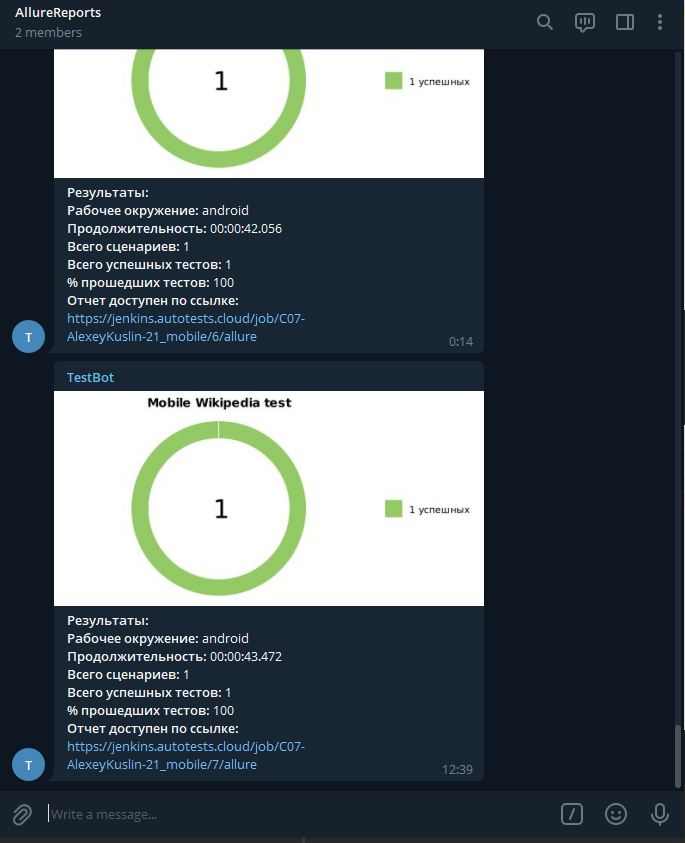
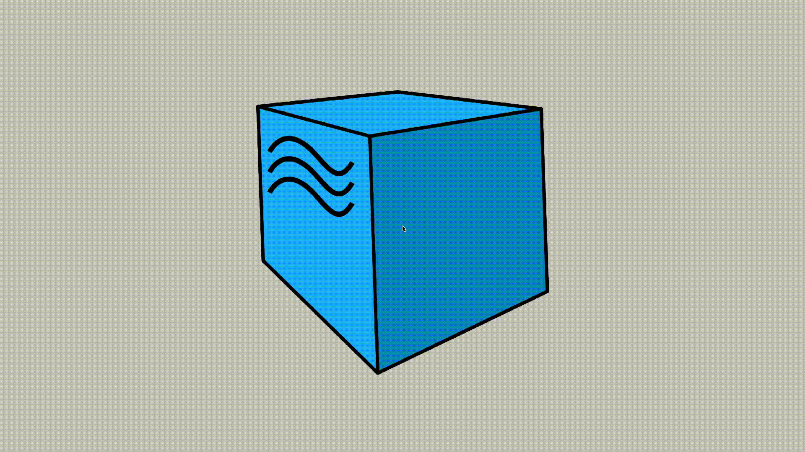

# Wikipedia Android tests

## Используемые технологии:


## Команды для запуска тестов:
### Запуск тестов Appium (default):

```
gradle clean test -Ddevice.name=appium
```

где appium это настройки для real или emulator

### Запуск тестов Selenoid:

```
gradle clean test -Ddevice.host=selenoid
```

### Запуск тестов BrowserStack:

```
gradle clean test -Ddevice.host=browser_stack
```
## Более подробно с результатми тестов (шаги, скриншоты, видео прохождения теста, page source и browser console log) можно ознакомиться:
## [Jenkins](https://jenkins.autotests.cloud/job/C07-AlexeyKuslin-21_mobile/):


## [Allure Report](https://jenkins.autotests.cloud/job/C07-AlexeyKuslin-21_mobile/7/allure/):



## [Allure TestOps](https://allure.autotests.cloud/launch/7936/tree/67596?search=W3siaWQiOiJzdGF0dXMiLCJ0eXBlIjoidGVzdFN0YXR1c0FycmF5IiwidmFsdWUiOlsicGFzc2VkIl19XQ%3D%3D&treeId=0):



## Уведомления о прохождении теста приходит в телеграм:


## Видео прохождения теста, взятое из среды выполнения (из Selenoid):
